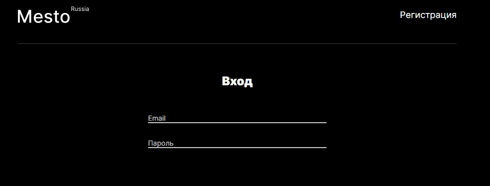
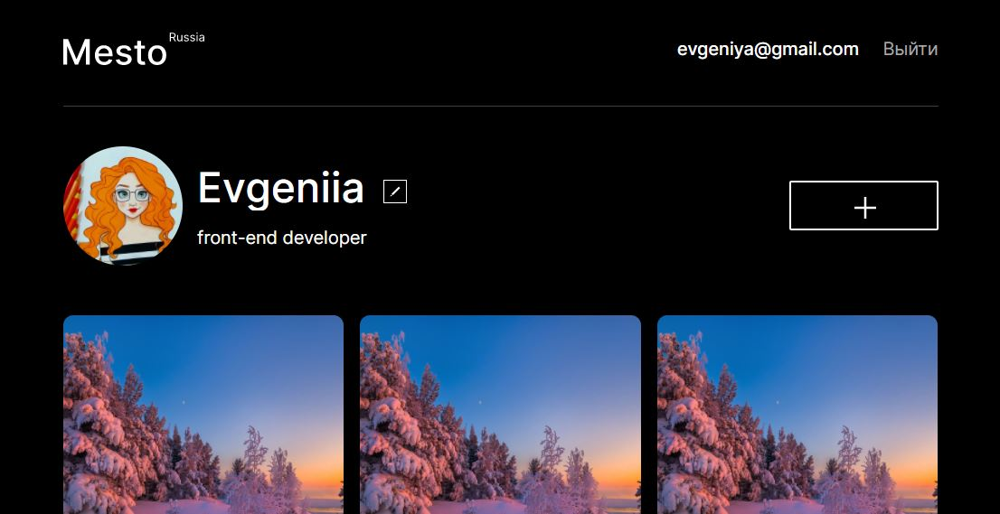
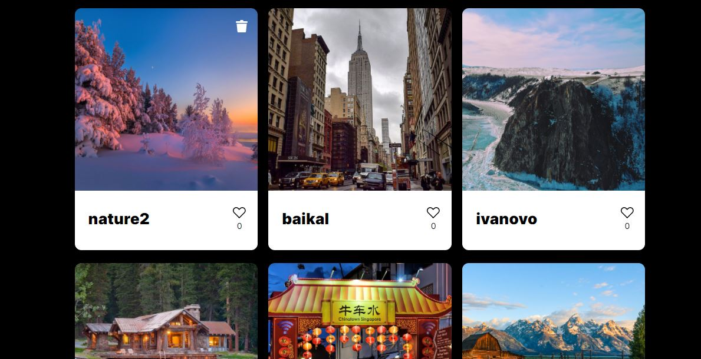

EN and RUS description

# Mesto - app for pictures of your favourite places! :mount_fuji:  

Welcome to Mesto website! This is a perfect place to share your pictures of beautiful places with people!  

## Demo link:  

You can visit homepage of the app here: https://react-burger-f9d9ibv6g-evgeniiazu8ova.vercel.app/  
Unfortunately, you won't be able to login here, as you need to run back-end on your local machine (you will find instructions further). However, you can also get familiar with app without need to login here (this is another version of project without self-made back-end, using third-party API): https://evgeniiazu8ova.github.io/mesto-react/  

## Table of Content:  

* About The App   
* Technologies  
* Setup  
* Status  

## About The App  

  

First of all, you will get on authorization page, where you need to login or create profile if you are not registered yet.  

  

If you authorized, you will get to main page. Here you can change your personal details - click on profile photo, if you want to change it, and provide link to necessary picture. Also you can change your name and profession - click on edit icon near with name.  

  

You can add new pictures here - click on plus button and provide picture name and link to form in modal window. You can click on pictures to see bigger card. Also you can put and remove likes to pictures. Also you can delete your cards - your cards will be provide with delete icons at the top right part of the card.  

  

## Technologies  

React, JavaScript, Node.js, Express.js, MongoDB.  

## Setup  

This repository contains two directories - backend and frontend. First of all, download or clone the repository. Then you need to open two terminals, in one of them move to backend folder (cd backend/), run ```npm install``` and then ```npm start```. Back-end part will be run on http://localhost:3001 url. In the second terminal move to frontend directory (cd frontend/), run ```npm install``` and then ```npm start``` also. Front-end part will be run on http://localhost:3000 url. 

At the same time both back-end and front-end parts should be run.  

## Status  

This app is available in Russian language only at the moment. Also you can get access to full set of options only if you run back-end and front-end on your local machine. It is important to know, that this app does not have mobile layout at the moment, that is why it will be shown correctly only on desktop.  


# Mesto - приложение для фотографий из ваших любимых мест планеты! :mount_fuji:  

Добро пожаловать на сайт Mesto! Это идеальное место для того, чтобы поделиться с людьми фотографиями из ваших любимых мест планеты!  

## Ссылка:  

Вы можете просмотреть страницу авторизации приложения здесь: https://react-burger-f9d9ibv6g-evgeniiazu8ova.vercel.app/  
Но, к сожалению, перейдя по этой ссылке вы не сможете авторизоваться, поскольку необходимо запустить бэкенд приложения локально на вашем компьютере (инструкции приводятся ниже). Однако, вы можете ознакомиться с приложением без необходимости авторизации здесь (это другая версия приложения, в которой используется стороннее API): https://evgeniiazu8ova.github.io/mesto-react/  

## Содержание:  

* О приложении   
* Технологии  
* Установка  
* Статус  

## О приложении  

  

Прежде всего, вы попадаете на страницу авторизации, где вам необходимо войти в свой аккаунт или создать его, если вы ещё не зарегистрированы.  

  

Если вы авторизованы, вы попадёте на главную страницу. Здесь вы можете изменить личные данные - кликните на фотографию профиля, если хотите заменить её, и вставьте ссылку на новую фотографию. Также можно изменить имя и профессию - нажмите на иконку редактирования возле имени.  

  

Здесь можно добавлять новые картинки - нажмите на кнопку с плюсом и вставьте название и ссылку на картинку в форму в открывшемся окне. Вы можете просмотреть увеличенную картинку, кликнув по ней. Вы можете ставить и убирать лайки под картинками. Вы можете удалять свои картинки - на ваших карточках в верхнем правом углу будет иконка удаления.  

  

## Технологии  

React, JavaScript, Node.js, Express.js, MongoDB.  

## Установка  

В этом репозитории есть две директории - backend и frontend. Прежде всего, скачайте или клонируйте репозиторий. Затем откройте два терминала, в одном из них перейдите в папку с бэкендом (cd backend/), запустите команду ```npm install``` и далее ```npm start```. Бэкенд запустится на адресе http://localhost:3001. Во втором терминале перейдите в папку с фронтендом (cd frontend/), запустите команду ```npm install``` и далее ```npm start```. Фронтенд запустится на адресе http://localhost:3000. 

Для корректной работы приложения у вас должны быть запущены и бэкенд и фронтенд.    

## Статус  

В настоящий момент у приложения есть только русскоязычная версия. Также стоит учесть, что полный функционал приложения будет доступен только при запуске бэкенда и фронтенда локально на вашем компьютере. Важное замечание: в данный момент у приложения нет мобильной версии, поэтому оно будет отображаться корректно только на больших разрешениях.


